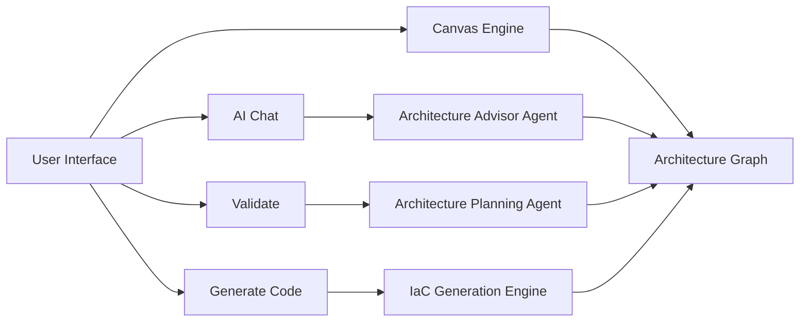

# Agentic-Cloud-Architect (A3)

Agentic-Cloud-Architect (A3) is a visual Infrastructure-as-Code designer for Azure.
Design on a canvas, validate with AI guidance, and generate modular Bicep from one source of truth.

## Demo

- Watch demo on YouTube: https://www.youtube.com/watch?v=_TUYuvJ1Wy0
- MVP demo video file in repo: [Videos and Images/Agentic-Cloud-Architect-MVP-Demo.mp4](Videos%20and%20Images/Agentic-Cloud-Architect-MVP-Demo.mp4)

> Note: GitHub does not reliably render embedded `<video>`/`<iframe>` content in README files, so demo links are provided directly.

## Highlights

- Visual Azure architecture design with drag-and-drop canvas
- AI Chat for architecture guidance
- Validate workflow with actionable tips
- One-click IaC generation (Azure Bicep)
- Project canvas state as the single source of truth

## Quick Start

Prerequisites:

- Docker
- Docker Compose

Run locally:

```bash
docker-compose up -d --build
```

Open: http://localhost:3000

Clean rebuild:

```bash
docker-compose down --rmi all --volumes && docker-compose up --build -d
```

## Project Structure

```text
Agentic-Cloud-Architect/
├── Agents/                  # AI agents (chat, validation, IaC)
├── App_Backend/             # FastAPI backend
├── App_Frontend/            # Canvas and UI pages
├── App_State/               # Runtime settings/logs (gitignored where needed)
├── Clouds/                  # Azure catalogs, schemas, icons
├── Projects/                # Per-project state and generated IaC
├── Tools/                   # Local helper scripts
├── docker-compose.yml
└── Dockerfile
```

## Architecture Overview



## Core Workflow

1. Create/open a project.
2. Design resources on the canvas.
3. Ask architecture questions in AI Chat.
4. Run Validate and apply suggestions.
5. Generate Bicep from the finalized design.

## Configuration

Create `App_State/app.settings.env` with your runtime settings.

Typical fields include:

- `MODEL_PROVIDER`
- Azure auth values (`AZURE_TENANT_ID`, `AZURE_CLIENT_ID`, `AZURE_CLIENT_SECRET`, `AZURE_SUBSCRIPTION_ID`)
- Foundry settings (`AI_FOUNDRY_ENDPOINT`, model deployment names, agent IDs)

## Additional Docs

- Architecture diagrams: [ARCHITECTURE_DIAGRAMS.md](ARCHITECTURE_DIAGRAMS.md)

## License

Use according to your repository license policy.