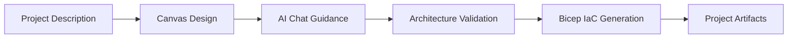
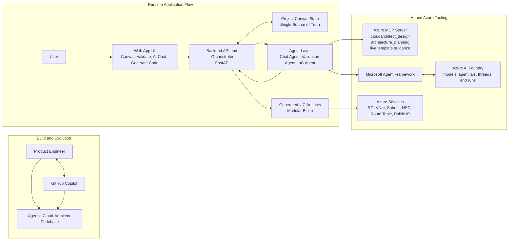

# Agentic Cloud Architect (A3)

Agentic Cloud Architect is a visual, AI-assisted Infrastructure-as-Code platform for Azure.
It helps teams move from architecture idea → validated design → generated Bicep using one shared project state.

🚀 **[Live Demo](https://a3-app.whitedune-b3d45872.norwayeast.azurecontainerapps.io/landing.html)** — Try it now on Azure!

> [!WARNING]
> This project is under development and can misbehave if startup steps are skipped.
> Verify and save **Application Settings** before doing anything else, otherwise chat/validation/codegen may fail silently.

> [!IMPORTANT]
> **Screen load latency notice:** after clicking screens like Projects, Settings, Canvas, Validate, or Generate Code,
> the next page may take time to load. Please wait for navigation to complete.

## Reviewer Quick Path (2 minutes)

1. Watch demo: https://www.youtube.com/watch?v=_TUYuvJ1Wy0
2. Review architecture: [ARCHITECTURE_DIAGRAMS.md](ARCHITECTURE_DIAGRAMS.md)
3. Review score alignment: [Judging Criteria Alignment (5 x 20%)](#judging-criteria-alignment-5-x-20)
4. Read narrative rubric coverage: [Story: From Origin to Execution](#story-from-origin-to-execution)
5. Check working proof: [Working Solution Evidence](#working-solution-evidence)

---

## Story: From Origin to Execution

### 1) Origin — The Problem

Designing Azure systems is usually fragmented:

- Architecture reasoning lives in chat or docs.
- Topology is drawn in separate diagram tools.
- IaC is written later and can drift from the design.
- Reliability/security issues are caught late in review cycles.

This leads to rework, slower delivery, and higher deployment risk.

### 2) Real-World Use Case and Audience

This solution is for cloud architects, platform teams, and app teams that need to:

- collaboratively design Azure architecture,
- validate design decisions against best practices,
- generate deployment-ready IaC from the same source of truth.

Typical scenarios include startup MVP delivery, enterprise modernization, and architecture-gate reviews before implementation.

### 3) Why It Matters

A3 reduces architecture-to-implementation friction by making the canvas state the system contract between human decisions and automation.
Teams move faster with better consistency, traceability, and quality.

### 4) Solution Approach

Agentic Cloud Architect combines:

- Visual Azure architecture canvas
- Specialized AI agents (Chat, Validation, IaC Generation)
- Azure-grounded guidance through MCP
- Generated modular Bicep artifacts

The flow is intentionally sequential so each phase feeds the next phase.

### 5) Practical Microsoft AI Implementation

The architecture uses Microsoft AI capabilities as core system components, not as add-ons. Azure AI Foundry provides the model and agent runtime for chat, validation, and code-generation flows. Microsoft Agent Framework structures agent behavior and execution, while Azure MCP context strengthens architecture guidance and IaC guardrails against Azure-specific patterns. This combination adds measurable value by improving recommendation quality, reducing design drift, and making generated output more deployment-ready.

### 6) Working Prototype and Execution Depth

This is a functional MVP with an end-to-end workflow that can be executed locally: define project context, design the canvas, validate architecture decisions, and generate modular Bicep. The implementation includes multi-agent orchestration, project/thread context handling, and guardrail-aware generation stages. Reviewers can evaluate both concept quality and implementation realism using the architecture diagram, working flow, and runnable setup.

### 7) Documentation and Storytelling Assets

The documentation is intentionally structured from problem origin to execution so each section naturally leads to the next one. Setup instructions include mandatory startup sequencing, and evidence sections include demo video, architecture visuals, and screenshots of major workflow milestones. This makes the submission concise for quick review while still complete enough for technical evaluation.

---

## Judging Criteria Alignment (5 x 20%)

This section maps the solution to each equally-weighted judging dimension and points reviewers to concrete evidence.

| Dimension (20%) | How this project addresses it | Reviewer evidence |
|---|---|---|
| Technological Implementation | Uses clear separation of concerns across frontend canvas, FastAPI backend, and specialized agent modules (chat, validation, IaC). Workflow is deterministic from project state to generated output, with containerized local execution. | Sections: Story, End-to-End Workflow, Project Structure. Files/folders: `App_Backend/`, `App_Frontend/`, `Agents/`, `docker-compose.yml`. |
| Agentic Design & Innovation | Applies an agentic multi-role design where distinct agents collaborate through shared project context and staged orchestration. AI is used for architecture reasoning, validation feedback, and guarded IaC generation. | Sections: Story (Solution Approach, Practical Microsoft AI Implementation), Architecture Overview, Practical Use of Microsoft AI Technologies. |
| Real-World Impact & Applicability | Targets a real pain point: architecture-to-IaC drift. Supports practical outcomes for cloud architects and platform teams by converting design intent into reviewable and deployable artifacts. | Sections: Story (Origin, Use Case, Why It Matters), Working Solution Evidence, End-to-End Workflow. |
| User Experience & Presentation | Provides a visual and guided UX: canvas design, validation, AI chat, and code generation. Submission presentation includes walkthrough narrative, screenshots, architecture diagram, and demo video for clear evaluation. | Sections: Working Solution Evidence, Architecture Overview, Getting Started. Assets: `Videos and Images/`. |
| Adherence to Hackathon Category | Aligns with Microsoft-focused agentic solution themes by combining Azure services, Azure AI Foundry, Microsoft Agent Framework, and MCP-guided cloud architecture workflows. | Sections: Practical Use of Microsoft AI Technologies, Story, Architecture Overview. |

> Final submission tip: keep demo narration aligned to these five dimensions in the same order so judges can score quickly and consistently.

---

## Practical Use of Microsoft AI Technologies

| Microsoft technology | How A3 uses it | Value added |
|---|---|---|
| Azure AI Foundry | Hosts model deployments, agent definitions, and thread/run lifecycle for chat/validation/codegen flows | Consistent, production-oriented AI runtime for multi-agent orchestration |
| Microsoft Agent Framework | Executes structured agent interactions in backend workflows | Reusable agent behavior instead of ad-hoc prompting |
| Azure MCP tooling | Grounds architecture chat, validation guidance, and IaC guardrails in Azure context | Improves relevance and quality of recommendations/output |
| Azure Identity + AI Project client | Authenticates and accesses Foundry resources securely | Enterprise-friendly identity and integration pattern |

> A local model path (`ollama-local`) is not supported yet. Azure Foundry is the primary cloud AI path.

---

## End-to-End Workflow (Execution)

1. Configure app settings and AI provider.
2. Create/select project and add application description.
3. Design resources and connections on canvas.
4. Use AI Chat for architecture guidance.
5. Run Validation and review findings.
6. Generate Bicep from finalized design.
7. Save/export state and project artifacts.



---

## Working Solution Evidence

### Functional Prototype Status

Current MVP demonstrates an end-to-end working flow:

- Visual Azure design on canvas
- AI chat-based architecture assistance
- Validation report generation with actionable findings
- IaC generation pipeline (modular Bicep)
- Project save/load with persisted artifacts

### Currently Supported Resources (MVP Scope)

- Resource Groups
- Virtual Networks
- Subnets
- Network Security Groups
- Route Tables
- Public IP Addresses

### Demo Video

- YouTube: https://www.youtube.com/watch?v=_TUYuvJ1Wy0
- In-repo video: [Videos and Images/Agentic-Cloud-Architect-MVP-Demo.mp4](Videos%20and%20Images/Agentic-Cloud-Architect-MVP-Demo.mp4)

### Screenshots

<details open>
  <summary>Open screenshot gallery (click thumbnail for full image)</summary>

<table>
  <tr>
    <td align="center">
      <a href="Videos%20and%20Images/0-TODO.png"></a><br>
      TODO
    </td>
    <td align="center">
      <a href="Videos%20and%20Images/1-Landing-Page.png"></a><br>
      Landing Page
    </td>
    <td align="center">
      <a href="Videos%20and%20Images/2-Application-Settings.png"></a><br>
      Application Settings
    </td>
  </tr>
  <tr>
    <td align="center">
      <a href="Videos%20and%20Images/3-Select-project.png"></a><br>
      Select Project
    </td>
    <td align="center">
      <a href="Videos%20and%20Images/4-Project-loading.png"></a><br>
      Project Loading
    </td>
    <td align="center">
      <a href="Videos%20and%20Images/5-Canvas-view.png"></a><br>
      Canvas View
    </td>
  </tr>
  <tr>
    <td align="center">
      <a href="Videos%20and%20Images/6-View-Resource-Property.png"></a><br>
      Resource Property
    </td>
    <td align="center">
      <a href="Videos%20and%20Images/7-Start-Validation.png"></a><br>
      Start Validation
    </td>
    <td align="center">
      <a href="Videos%20and%20Images/8-Validation-Report.png"></a><br>
      Validation Report
    </td>
  </tr>
  <tr>
    <td align="center">
      <a href="Videos%20and%20Images/9-Generate-Code.png"></a><br>
      Generate Code
    </td>
    <td align="center">
      <a href="Videos%20and%20Images/10-Coding-Guardrails.png"></a><br>
      Coding Guardrails
    </td>
    <td align="center">
      <a href="Videos%20and%20Images/11-Successful-CodeGeneration.png"></a><br>
      Successful Code Generation
    </td>
  </tr>
  <tr>
    <td align="center">
      <a href="Videos%20and%20Images/TechnicalArchitecture.png"></a><br>
      Technical Architecture
    </td>
    <td></td>
    <td></td>
  </tr>
</table>

</details>

---

## Architecture Overview



---

## Getting Started (Run Locally)

### Prerequisites

- Docker
- Docker Compose (only if running from source)

### Azure AI Foundry prerequisites

- Ensure your Microsoft Entra ID app registration has permissions to access Azure AI Foundry and to deploy/manage agents and threads.
- Deploy compatible model deployments in Foundry before creating agents (typically OpenAI models such as GPT-5.2).

### Quick Start (Docker Hub image, no clone)

Basic run:

```bash
docker pull mohit13/agentic-cloud-architect:beta
docker run -d --name agentic-cloud-architect -p 3000:3000 \
  mohit13/agentic-cloud-architect:beta
```

Persistent data (recommended):

```bash
docker pull mohit13/agentic-cloud-architect:beta
docker run -d --name agentic-cloud-architect -p 3000:3000 \
  -v "$PWD/App_State:/workspace/App_State" \
  -v "$PWD/Projects:/workspace/Projects" \
  mohit13/agentic-cloud-architect:beta
```

Open: http://localhost:3000

### Run from source (clone repo)

```bash
git clone https://github.com/dashanan13/Agentic-Cloud-Architect.git
cd Agentic-Cloud-Architect
docker-compose up -d --build
```

Open: http://localhost:3000

### Mandatory first action

Before using Chat, Validation, or Code Generation:

1. Open **Application Settings**
2. Click **Verify**
3. Click **Save**

If this is skipped, AI workflows may fail silently.

### Optional clean rebuild

```bash
docker-compose down --rmi all --volumes && docker-compose up --build -d
```

---

## Project Structure

```text
Agentic-Cloud-Architect/
├── Agents/                  # AI agents (chat, validation, IaC)
├── App_Backend/             # FastAPI backend
├── App_Frontend/            # Canvas and UI pages
├── App_State/               # Runtime settings/logs
├── Clouds/                  # Azure catalogs, schemas, icons
├── Projects/                # Project state and generated IaC
├── Tools/                   # Local helper scripts
├── docker-compose.yml
└── Dockerfile
```

---

## Additional Docs

- Architecture details: [ARCHITECTURE_DIAGRAMS.md](ARCHITECTURE_DIAGRAMS.md)

## License

Use according to your repository license policy.

