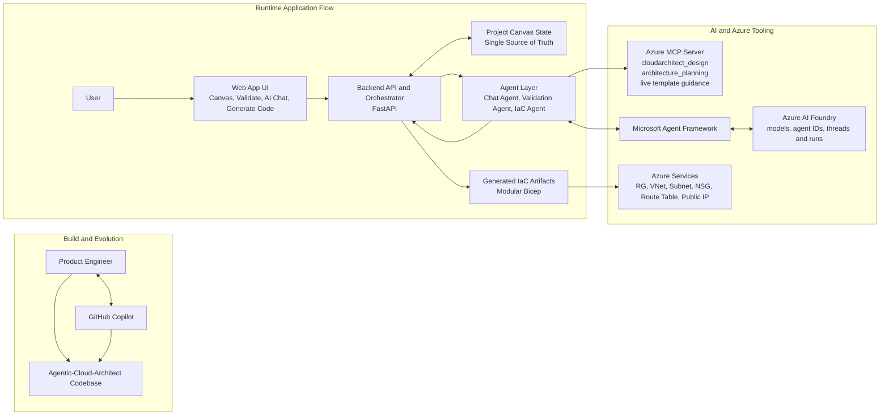

# Agentic-Cloud-Architect (A3)

> [!WARNING]
> This project is under developement and may misbehave if instructions are not followed.
> Verify and save **Application Settings** before doing anything else, otherwise silent failures may occur.

> [!IMPORTANT]
> **Screen load latency notice:** after you click buttons that open another screen (for example: Projects, Settings, Canvas, Validate, Generate Code), the next screen can take time to load.
> Please be patient while navigation finishes. Latency improvements are in progress.

Agentic-Cloud-Architect (A3) is a visual Infrastructure-as-Code designer for Azure.
Design on a canvas, validate with AI guidance, and generate modular Bicep from one source of truth.

## Demo

- Watch demo on YouTube: https://www.youtube.com/watch?v=_TUYuvJ1Wy0
- MVP demo video file in repo: [Videos and Images/Agentic-Cloud-Architect-MVP-Demo.mp4](Videos%20and%20Images/Agentic-Cloud-Architect-MVP-Demo.mp4)

> Note: GitHub does not reliably render embedded `<video>`/`<iframe>` content in README files, so demo links are provided directly.

## Screenshots

GitHub README files do not support JavaScript-based tabs/slideshows, so this uses a compact collapsible gallery.

<details open>
  <summary>Open screenshot gallery (click thumbnail for full image)</summary>

<table>
  <tr>
    <td align="center">
      <a href="Videos%20and%20Images/0-TODO.png"></a><br>
      TODO
    </td>
    <td align="center">
      <a href="Videos%20and%20Images/1-Landing-Page.png"></a><br>
      Landing Page
    </td>
    <td align="center">
      <a href="Videos%20and%20Images/2-Application-Settings.png"></a><br>
      Application Settings
    </td>
  </tr>
  <tr>
    <td align="center">
      <a href="Videos%20and%20Images/3-Select-project.png"></a><br>
      Select Project
    </td>
    <td align="center">
      <a href="Videos%20and%20Images/4-Project-loading.png"></a><br>
      Project Loading
    </td>
    <td align="center">
      <a href="Videos%20and%20Images/5-Canvas-view.png"></a><br>
      Canvas View
    </td>
  </tr>
  <tr>
    <td align="center">
      <a href="Videos%20and%20Images/6-View-Resource-Property.png"></a><br>
      Resource Property
    </td>
    <td align="center">
      <a href="Videos%20and%20Images/7-Start-Validation.png"></a><br>
      Start Validation
    </td>
    <td align="center">
      <a href="Videos%20and%20Images/8-Validation-Report.png"></a><br>
      Validation Report
    </td>
  </tr>
  <tr>
    <td align="center">
      <a href="Videos%20and%20Images/9-Generate-Code.png"></a><br>
      Generate Code
    </td>
    <td align="center">
      <a href="Videos%20and%20Images/10-Coding-Guardrails.png"></a><br>
      Coding Guardrails
    </td>
    <td align="center">
      <a href="Videos%20and%20Images/TechnicalArchitecture.png"></a><br>
      Technical Architecture
    </td>
  </tr>
</table>

</details>

## Highlights

- Visual Azure architecture design with drag-and-drop canvas
- AI Chat for architecture guidance
- Validate workflow with actionable tips
- One-click IaC generation (Azure Bicep)
- Project canvas state as the single source of truth

## Supported Resources (Current)

Current resource support (as reflected in the TODO scope and active IaC path):

- Resource Groups
- Virtual Networks
- Subnets
- Network Security Groups
- Route Tables
- Public IP Addresses

## Getting Started (Important Order)

Prerequisites:

- Docker
- Docker Compose

1) Clone the repository

```bash
git clone https://github.com/dashanan13/Agentic-Cloud-Architect.git
cd Agentic-Cloud-Architect
```

2) Start the containerized app

```bash
docker-compose up -d --build
```

3) Open the app

- URL: http://localhost:3000

4) **Before anything else**: open Application Settings, then **Verify** and **Save**

- If you skip this step, chat/validation/codegen may fail silently.
- When opening a screen from a button click, allow extra time for the next screen to load. Please wait for navigation to complete.

<a href="Videos%20and%20Images/2-Application-Settings.png">
  
</a>

5) Create or select a project and enter a detailed project description

- Better descriptions give better AI guidance and validation quality.

6) Build your architecture on canvas

- Drag and drop supported resources to design your diagram.

7) Click **Validate** and review recommendations

- Use validation output to align with Well-Architected guidance and best practices.

<a href="Videos%20and%20Images/8-Validation-Report.png">
  
</a>

8) Use **AI Chat** with the cloud architect assistant

- Ask about Azure concepts, architecture documentation, trade-offs, security, and design improvements.

9) Save project and export diagram image

- Use **Save** and **Export** from the canvas toolbar.

10) Generate IaC code

- Click **Generate Code** to produce Bicep output.

<a href="Videos%20and%20Images/9-Generate-Code.png">
  
</a>

Optional clean rebuild:

```bash
docker-compose down --rmi all --volumes && docker-compose up --build -d
```

## Project Structure

```text
Agentic-Cloud-Architect/
├── Agents/                  # AI agents (chat, validation, IaC)
├── App_Backend/             # FastAPI backend
├── App_Frontend/            # Canvas and UI pages
├── App_State/               # Runtime settings/logs (gitignored where needed)
├── Clouds/                  # Azure catalogs, schemas, icons
├── Projects/                # Per-project state and generated IaC
├── Tools/                   # Local helper scripts
├── docker-compose.yml
└── Dockerfile
```

## Architecture Overview



This diagram emphasizes where each key technology is used:

- GitHub Copilot supports engineering and iteration during build time.
- Azure MCP provides architecture/tool grounding (`cloudarchitect_design`, planning, templates).
- Microsoft Agent Framework + Azure AI Foundry power model-driven agent execution.
- Azure services are the deployment target for generated IaC.

## Core Workflow

1. Create/open a project.
2. Design resources on the canvas.
3. Ask architecture questions in AI Chat.
4. Run Validate and apply suggestions.
5. Generate Bicep from the finalized design.

## Configuration

Create `App_State/app.settings.env` with your runtime settings.

Typical fields include:

- `MODEL_PROVIDER`
- Azure auth values (`AZURE_TENANT_ID`, `AZURE_CLIENT_ID`, `AZURE_CLIENT_SECRET`, `AZURE_SUBSCRIPTION_ID`)
- Foundry settings (`AI_FOUNDRY_ENDPOINT`, model deployment names, agent IDs)

## Additional Docs

- Architecture diagrams: [ARCHITECTURE_DIAGRAMS.md](ARCHITECTURE_DIAGRAMS.md)

## License

Use according to your repository license policy.

