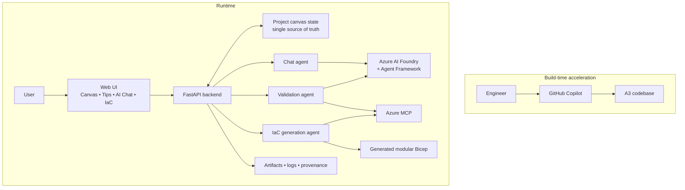

<div align="center">

# Agentic Cloud Architect (A3)

### Design Azure architecture visually. Validate it with grounded AI. Generate deployable IaC from a single source of truth.

<p>
  
  
  
  
</p>

<p>
  <strong>Agentic Cloud Architect</strong> turns cloud architecture from a slow diagram-and-documentation exercise into an interactive design loop:<br/>
  <strong>describe</strong> → <strong>design</strong> → <strong>validate</strong> → <strong>generate</strong>.
</p>

</div>

> 🎥 **Competition demo video coming soon.** Add your walkthrough, narrated demo, or product trailer here later.

---

## Why this project matters

Architecting cloud systems usually means bouncing between whiteboards, Azure documentation, best-practice articles, dependency decisions, and hand-written IaC.

That workflow is slow, repetitive, and mentally expensive.

**Agentic Cloud Architect** compresses that entire knowledge-sorting exercise into one workspace by combining:

- a **visual Azure design canvas**
- **architecture-aware AI assistance**
- **Azure-grounded validation** through Azure MCP
- **Azure AI Foundry-powered agent workflows**
- **production-minded IaC generation** from the architecture itself

The result is a tool that helps teams move from an idea to a reviewed Azure architecture much faster, with better consistency and far less context switching.

---

## The one-line pitch

**A3 is a visual, agentic Azure architecture workbench that helps teams think, validate, and generate infrastructure code in one place.**

---

## What makes A3 competition-worthy

| Differentiator | Why it stands out |
|---|---|
| **Single source of truth** | The canvas state drives chat, validation, and code generation. No drift between the diagram and the implementation path. |
| **Clever tool composition** | Azure MCP brings architecture reasoning, Azure guidance, and live schema/template context into the workflow instead of relying on generic AI output. |
| **Foundry + Agent Framework integration** | Azure AI Foundry and Microsoft Agent Framework-style execution power agent conversations, reasoning, and threaded workflows. |
| **Human-in-the-loop by design** | Users can design visually, review findings, and apply improvements intentionally instead of accepting opaque automation. |
| **Evidence-backed validation** | Validation is not just “AI said so” — the app tracks provenance, sources, structured steps, and logs for trust and explainability. |
| **Real productivity value** | It reduces the time spent researching Azure services, sorting best practices, recalling dependencies, and scaffolding first-pass IaC. |

---

## What the experience feels like

### 1. Describe the system you want to build
Users create a project, choose Azure, pick an application type, and write a project description.

The app even helps improve the description with AI, because better context leads to better architecture outcomes.

### 2. Design visually on the canvas
Drag Azure resources onto the canvas, configure them, and connect them as an architecture graph.

This becomes the project’s **shared source of truth**.

### 3. Ask architecture questions in plain English
The AI chat understands the project description and the current canvas state, so conversations stay grounded in the actual system being designed.

### 4. Validate the design
Validation combines deterministic checks, Azure MCP context, and Foundry-powered reasoning to surface:

- missing components
- weak patterns
- dependency issues
- best-practice opportunities
- Well-Architected style recommendations

### 5. Generate implementation-ready IaC
Once the architecture is solid, A3 converts the final design into modular infrastructure code.

**Primary generated output today:** modular Azure Bicep.

Project folders are also structured to support broader IaC workflows over time.

---

## Why this saves so much time

### Traditional workflow

```text
Idea -> Research Azure docs -> Sketch diagram -> Re-check dependencies -> Review best practices ->
Translate architecture into IaC -> Fix mismatches between diagram and code
```

### Agentic Cloud Architect workflow

```text
Describe -> Draw -> Validate -> Improve -> Generate
```

### What gets compressed

- **Documentation hunting** becomes guided, context-aware assistance
- **Dependency recall** becomes visual modeling plus validation support
- **Architecture review prep** becomes built-in validation and evidence
- **First-pass Bicep authoring** becomes automated generation from the final design
- **Knowledge sorting** becomes a structured interaction instead of a manual research marathon

---

## Architecture at a glance



For full ASCII versions, see [ARCHITECTURE_DIAGRAMS.md](ARCHITECTURE_DIAGRAMS.md).

---

## Innovation highlights

### Visual-first, but not diagram-only
This is not just a drawing tool.

The canvas becomes executable architecture context that powers:

- AI chat
- validation
- code generation
- persisted project artifacts

### AI where it adds leverage, determinism where it adds trust
A3 deliberately keeps the core system deterministic where safety and consistency matter most:

- canvas state
- resource relationships
- project persistence
- orchestration flow

AI is used where it provides the highest value:

- architecture reasoning
- project description improvement
- validation explanations
- implementation guidance
- code generation assistance

### Grounded Azure intelligence instead of generic suggestions
Azure MCP gives the system Azure-aware reasoning and live guidance instead of vague cloud advice.

This is one of the strongest aspects of the solution:

- architecture-level reasoning
- Azure best-practice alignment
- schema/template awareness for code generation
- more trustworthy Azure recommendations

### Trust through provenance and observability
The system captures structured validation telemetry and provenance so users can understand how recommendations were produced.

That makes the output more enterprise-ready and more credible in competition judging.

---

## Core capabilities

| Capability | What it delivers |
|---|---|
| **Project bootstrapping** | Create Azure projects with type selection, naming, description quality scoring, and AI-assisted description improvement. |
| **Visual architecture canvas** | Model Azure resources, configure properties, and connect services with a clean drag-and-drop workflow. |
| **Architecture-aware AI chat** | Ask questions about the current design and get guidance grounded in the project description and canvas state. |
| **Validation and tips** | Run architecture review workflows to surface gaps, design concerns, and improvement opportunities. |
| **Validation provenance** | Show how findings were produced, including tool-backed context and structured logging. |
| **IaC generation** | Generate modular Azure Bicep from the final architecture graph. |
| **Flexible model runtime** | Support Azure AI Foundry for cloud-hosted AI workflows and local Ollama for developer-friendly local setups. |

---

## Why the technical design is smart

### Azure AI Foundry
Used for cloud-hosted reasoning, agent execution, threaded conversations, and model-backed assistance.

### Microsoft Agent Framework
Used in the Foundry assistant runner path to manage agent-style execution over Foundry-connected AI workflows.

### Azure MCP
Used as the Azure-grounding layer for architecture guidance, validation context, and IaC-related schema/template guidance.

### GitHub Copilot
Used as a build-time accelerator for creating and evolving the product itself.

### Azure-first focus
The current competition version goes deep on Azure instead of being shallow across multiple clouds.

That focus is a strength: it lets the solution be more useful, more grounded, and more implementation-ready.

---

## Example user journey

1. A team describes a global identity-enabled web platform with security, compliance, and latency requirements.
2. They visually compose the Azure architecture on the canvas.
3. A3 uses the project description and canvas graph to answer design questions.
4. Validation surfaces missing layers such as ingress, observability, identity controls, or data decisions.
5. The team iterates quickly and converges on a cleaner architecture.
6. The final design is turned into modular IaC output, reducing the manual lift required to begin implementation.

---

## What judges and teams should notice

- **It solves a real pain point**: architecture work is fragmented and slow.
- **It uses modern tooling intelligently**: Foundry, Agent Framework, Azure MCP, and GitHub Copilot each have a clear role.
- **It is practical, not gimmicky**: the output is not just chat — it leads to concrete design improvements and code generation.
- **It improves trust**: provenance, logging, and deterministic state management make the system easier to believe in.
- **It shortens the path from idea to implementation**: that is the strongest business and engineering value proposition of the project.

---

## Technical stack

| Layer | Technology |
|---|---|
| **Frontend** | HTML, CSS, JavaScript |
| **Backend** | FastAPI, Uvicorn |
| **AI runtime** | Azure AI Foundry, local Ollama |
| **Agent execution** | Microsoft Agent Framework via Foundry integration |
| **Azure grounding** | Azure MCP |
| **Cloud identity** | Azure Identity |
| **IaC output** | Modular Azure Bicep |
| **Packaging** | Docker, Docker Compose |
| **Artifacts** | Project JSON state, generated IaC, logs, validation output |

---

## Demo section placeholder

> Replace this section later with your competition video, GIF walkthrough, or a short narrated product tour.

Suggested flow for the demo:

1. Create a project
2. Write a rich application description
3. Drag Azure services onto the canvas
4. Ask the AI architect for guidance
5. Run validation and review provenance
6. Generate modular IaC

---

## Quick start

### Prerequisites

- Docker
- Docker Compose

### Clean rebuild

```bash
docker-compose down --rmi all --volumes && docker-compose up --build -d
```

### Incremental rebuild

```bash
docker-compose up -d --build
```

Open the app at:

```text
http://localhost:3000
```

---

## Project structure

```text
Agentic-Cloud-Architect/
├── Agents/
│   ├── AzureAIFoundry/        # Foundry bootstrap, threaded agent workflows, model-backed helpers
│   ├── AzureMCP/              # Chat, validation, and IaC agents using Azure MCP context
│   └── common/                # Shared agent utilities and activity logging
├── App_Backend/               # FastAPI backend and API orchestration
├── App_Frontend/              # Canvas UI, project flows, tips, chat, and settings
├── App_State/                 # Runtime state, logs, and local app settings
├── Clouds/                    # Azure catalogs, icons, schemas, and resource metadata
├── Projects/                  # Per-project architecture state, documentation, diagrams, and IaC output
├── Dockerfile
├── docker-compose.yml
└── ARCHITECTURE_DIAGRAMS.md   # Competition-friendly ASCII architecture diagrams
```

---

## Current focus and scope

- **Cloud focus:** Azure
- **Primary code generation output:** Azure Bicep
- **AI providers:** Azure AI Foundry and local Ollama
- **Key strengths:** architecture reasoning, Azure-grounded validation, structured provenance, and fast first-pass code generation

This focus is intentional: the project aims to be deeply useful for Azure architecture design instead of broadly generic.

---

## Why A3 is memorable

Because it does something that feels obvious once you see it:

**it makes the architecture itself the living source of truth for conversation, review, and code generation.**

That is the core insight behind the project — and the reason it has strong competition potential.
